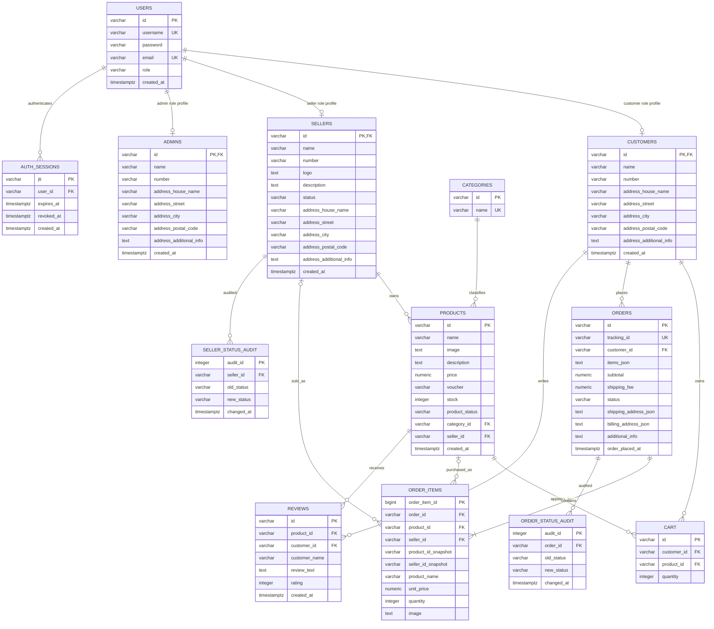

# GoCart Database Design

## Entity-Relationship Diagram

## Keys and Cardinalities

- Each account has one canonical row in `users`. Its ID is also the primary/foreign key of exactly one role profile; the stored role must match the profile table.
- A seller owns many products. Each product belongs to one seller and one category.
- Customers and products have a many-to-many cart relationship, represented by `cart`; `(customer_id, product_id)` is unique.
- Orders and products have a many-to-many relationship represented by `order_items`; each line stores quantity and purchase-time product details. `(order_id, product_id_snapshot)` is unique.
- Reviews are an associative entity between customers and products, with a unique `(product_id, customer_id)` pair and review-specific attributes.
- Each customer may place many orders. Audit records belong to one seller or order. A user may have many revocable login sessions.

## Normalization and Referential Actions

Credentials, login identifiers, and roles live only in `users`; profile tables hold role-specific data. Joined profile views preserve the API response shape without duplicating credentials. Profile IDs reference `users.id` with `ON DELETE CASCADE`. Database triggers reject profile rows whose role does not match the account and prevent role changes while a profile exists.

`order_items` is the normalized order/product bridge. `orders.items_json` remains as a compatibility snapshot for existing order payloads and legacy records; schema migration backfills the bridge from it, checkout writes both in one transaction, and order API reads build item arrays from `order_items`. Snapshot IDs and descriptive fields preserve purchase history after catalog deletion. Optional live product/seller foreign keys use `ON DELETE SET NULL`. `reviews.customer_name` preserves the name shown when the review was written, and `orders.subtotal` preserves the invoiced total; both are intentional historical snapshots.

Delete rules are explicit: orders restrict customer deletion; carts cascade with customers/products; category deletion is restricted while products use it; seller deletion cascades products; reviews cascade with products/customers; audit rows and sessions cascade with their parent. Foreign keys default to `ON UPDATE NO ACTION` because primary IDs are immutable, except auth sessions use `ON UPDATE CASCADE` to preserve sessions while migrating legacy account IDs.

CHECK/UNIQUE/DEFAULT rules enforce role and status domains, non-negative prices/stock/order totals, positive quantities, ratings from 1 to 5, case-insensitively unique usernames/emails/category names, unique cart and review pairs, unique tracking IDs, and unique order lines.

## Backend Foundation

The backend uses a shared `pg` connection pool and explicit `BEGIN`/`COMMIT`/`ROLLBACK` through `withTransaction`. Startup applies `schema.sql` and seeds demo data from `src/db/seed.ts`; startup aborts if initialization fails. Resource API routes use parameterized database functions/procedures. Checkout creates the order and line items, decrements inventory, and clears the cart atomically. Authentication routes are `POST /api/auth/login`, `GET /api/auth/me`, and `POST /api/auth/logout`; customer/seller signup is public, while admin creation requires an admin session.